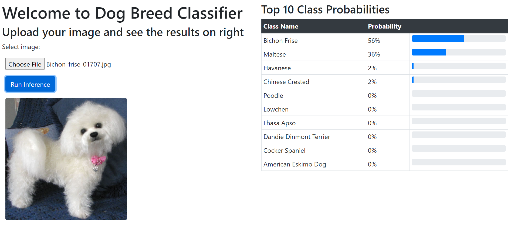
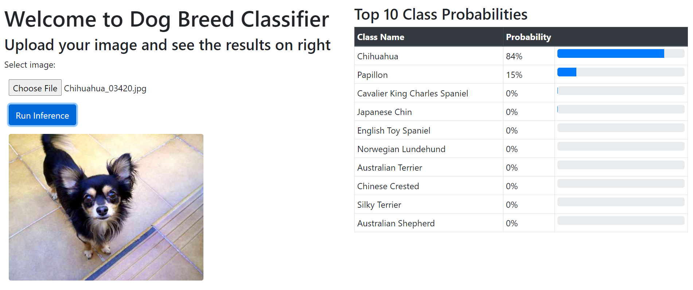
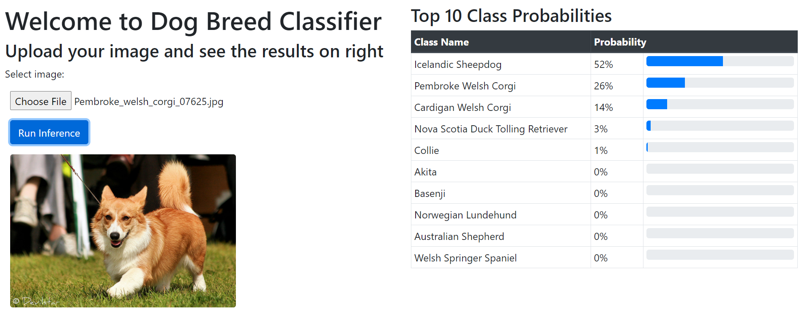
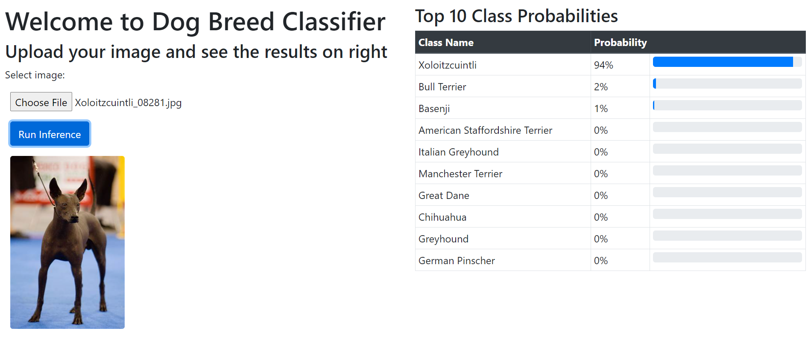

# Dog Breed Classifier

**In case you are running WSL and unable to connect to the server**
* Close the ubuntu window
* Open cmd and type `wsl --shutdown`
* Restart cmd and type `wsl`
* Now try running the commands

## Instructions
* **Data**
    * Run `make get_data` to download the data (around 1.1 GB in size)
* **Environment Setup**
    * Simply run `make setup_env`
* **Training**
    * Define the model architecture in the file `utils.py`
    * Define training related parameters in `training_script.py`
    * Logs are saved in `logs` while the models are saved in the folder `models` inside subfolders with the timestamp
    * Models are saved for all epochs
    * Run `python training_script.py`
    * Pre trained models will be downloaded first. Ensure net connection is working for that.
* **Web App**
    * Ensure that the model being read in the `app_server.py` script is present at `models -> timestamp -> 5 digit epoch number` (can also refer to the app_server code)
    * Run `make run_app`
    * In case there are problems with `conda init`, first activate the environment, and then run `python app_server.py`

## View of the web app

See [commit](db3ac5c) for the app server with the from scratch model.

## Results and comparisons
Following table gives a comparison of the models along with a few of the parameters
| Model | Classes | Input Size | Batch Size | Epochs | Learning Rate | Best Validation Accuracy | Log File |
| ----- | ------- | ---------- | ---------- | ------ | ------------- | ------------------------ | -------- |
| From Scratch | 10 | 32 | 128 | 100 | 0.001 | 40.8% | 202106121107 |
| From Scratch | 10 | 32 | 128 | 50 | 0.01 | 25.4% | 202106122044 |
| SqueezeNet | 133 | 224 | 32 | 5 | 0.01 | 24.2% | 202106142207 |
| SqueezeNet | 133 | 224 | 128 | 5 | 0.001 | 21.7% | 202106142251 |
| SqueezeNet | 133 | 224 | 128 | 50 | 0.001 | 19.9% | 202106150013 |
| VGG | 133 | 224 | 128 | 50 | 0.001 | 72.7% | 202106150749 |

From scratch models were trained on only the first 10 classes to get reasonable training times. Pretrained models have their last layer finetuned for all 133 classes. Squeezenet is not able to learn beyond a point while VGG has an edge from the start. The final app images shown above use the VGG model from epoch 8 (see [log](logs/202106150749), model file size is ~500MB).
