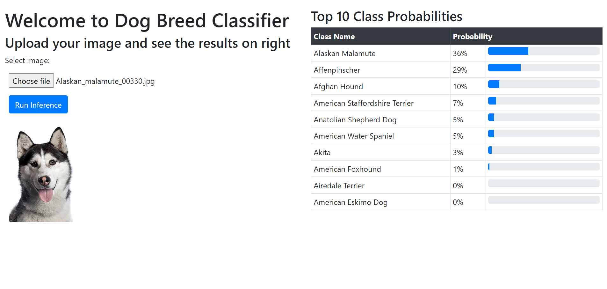

# Dog Breed Classifier

**In case you are running WSL and unable to connect to the server**
* Close the ubuntu window
* Open cmd and type `wsl --shutdown`
* Restart cmd and type `wsl`
* Now try running the commands

## Instructions
* **Data**
    * Run `make get_data` to download the data (around 1.1 GB in size)
* **Environment Setup**
    * Simply run `make setup_env`
* **Training**
    * Define the model architecture in the file `utils.py`
    * Define training related parameters in `training_script.py`
    * Logs are saved in `logs` while the models are saved in the folder `models` inside subfolders with the timestamp
    * Models are saved for all epochs
    * Run `python training_script.py`
* **Web App**
    * Ensure that the model being read in the `app_server.py` script is present at `models -> timestamp -> 5 digit epoch number`
    * Run `make run_app`
    * In case there are problems with `conda init`, first activate the environment, and then run `python app_server.py`

## View of the web app

